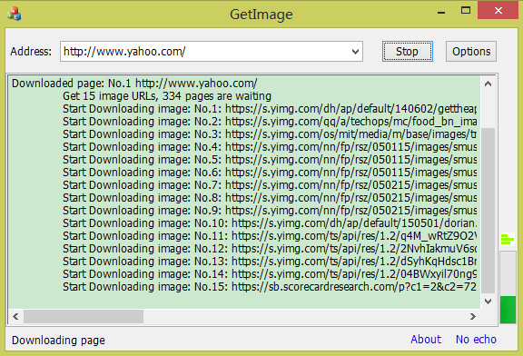
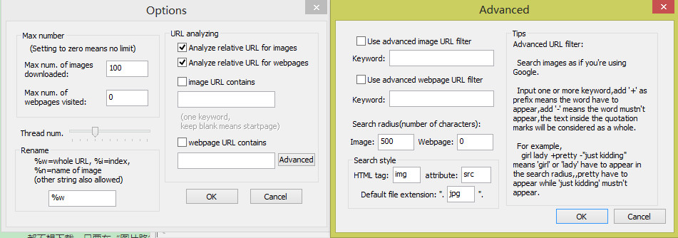

A web crawler for pictures based on MFC and VS2012.

Simple and scalable. Can be used to batch download the pictures on a website. Can also be configged to download other elements on a page, or filter keywords in URLs.

